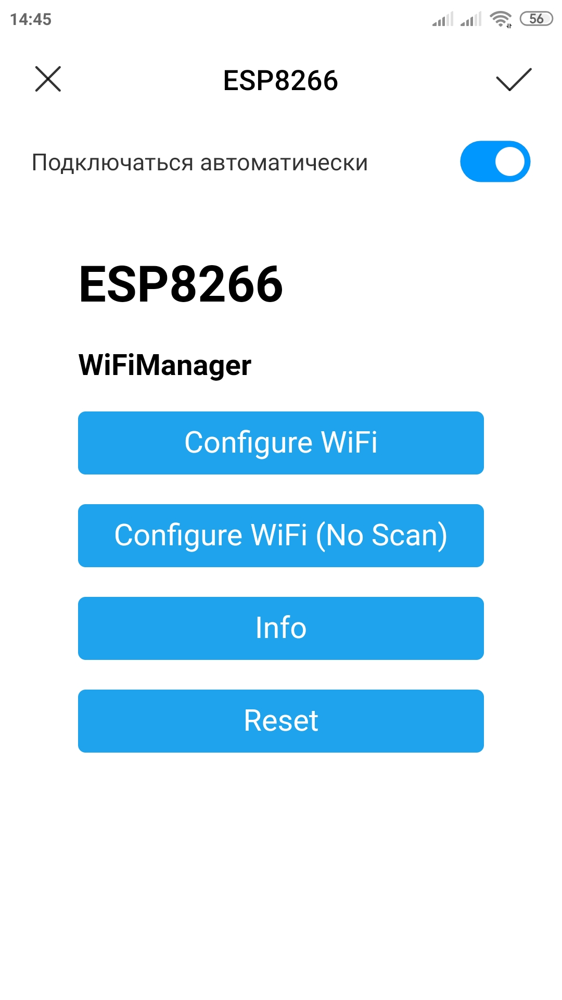
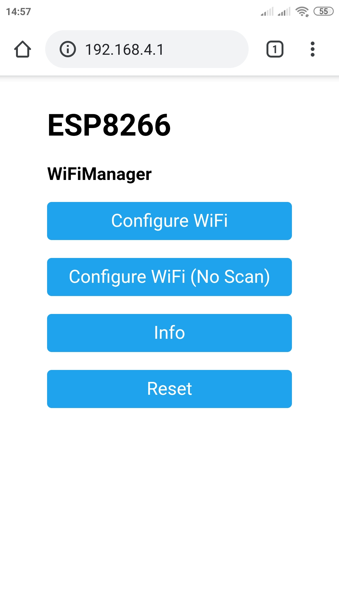
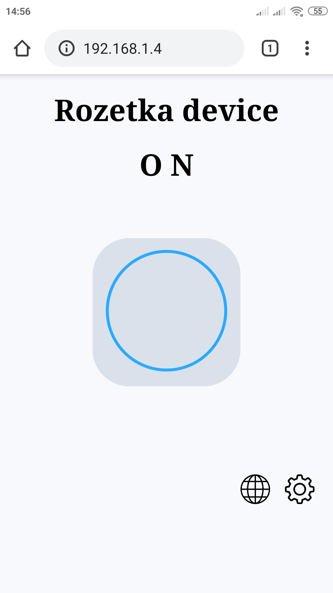
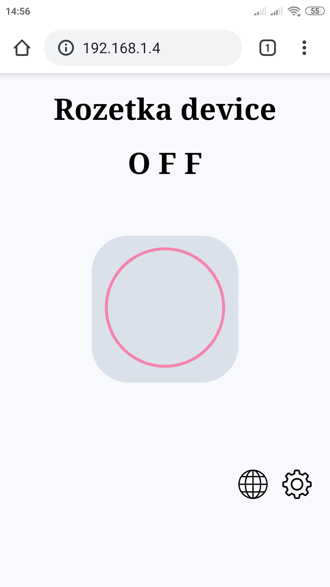
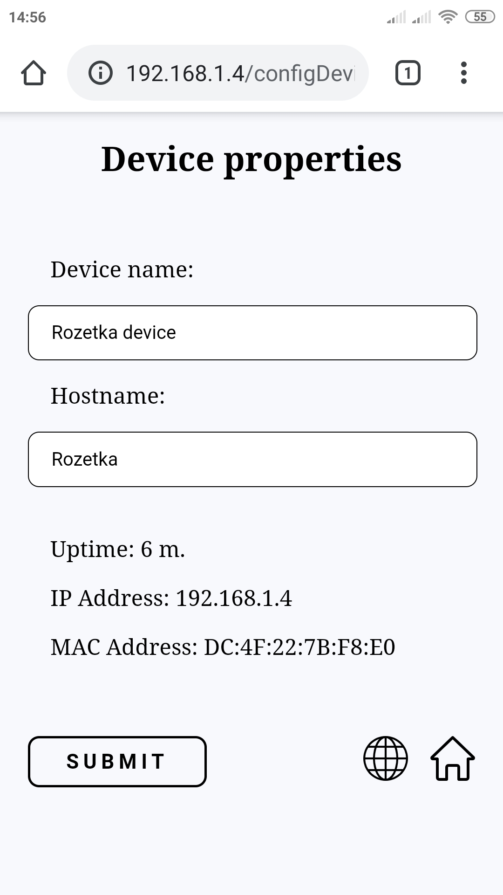

## Что может?
Вы можете использовать выход с пина микроконтроллера  для управления различной нагрузкой, включением и отключением света, различных устройств и тд. 

Управление осуществляется через веб страницу в браузере, по mqtt протоколу или по физической кнопке на устройстве.
В случае, если вы используете управление через веб страницу, вам необходимо подключиться к той же вайфай сети, к которой подключено устройство.

Управление по mqtt не имеет ограничений. Вам только необходим доступ к интернету и чтобы ваше устройство было подключено к вайфай сети с доступом в интернет.

Вы можете подключить кнопку, это даст вам возможность управлять устройством без необходимости использовать интернет, как обычным включателем.

Управление через веб реализовано на вебсокетах, отклик довольно быстрый. Так же, если вы переключите состояние другим способом, это отобразится на веб странице и отправится уведомление в mqtt топик.

Видеодемонстрацию можно посмотреть перейдя по этой ссылке: https://youtu.be/hraFdg5nPSk

## Требования
Вам необходимо готовое устройство на микроконтроллере esp8266. Это может быть готовое фирменное устройство или DIY-устройство. Для нормальной работы необходимо больше чем 512 кб flash памяти. Работа устройства успешно была проверена на таких чипах:
* ESP12F
* ESP12E

## Установка
Прошивка сделана в среде разработки Arduino IDE. Для прошивки устройства вам необходимо установить все дополнения для возможности прошивки esp8266 плат. А так же скачать следующие библиотеки для работы с wifi и mqtt:
* [WiFiManager](https://github.com/tzapu/WiFiManager)
* [pubsubclient](https://github.com/knolleary/pubsubclient)
* [arduinoWebSockets](https://github.com/Links2004/arduinoWebSockets)

Если вы не хотите использовать среду разработки Arduino IDE вы можете прошить бинарный файл из папки "bin" с помощью программы прошивальщика.

Вы можете указать свои порты микроконтроллера для выхода и подключения кнопки:
```
byte output = 12;
byte button = 0;
```

## Использование
При первом использовании необходимо подключить устройство к вайфай сети. Для этого нужно нажать reset и потом в течении 5 секунд удерживать кнопку, которую вы назначили для управления. 

!Важно. Если в качестве кнопки вы назначили пин 0, не зажимайте кнопку одновременно с reset. Это используется для прошивки микроконтроллера.

В списке доступных вайфай сетей найдите точку доступа устройства, подключитесь к ней. Вас автоматически переадресирует на страницу настройки WiFiManager. Если этого не произошло, откройте браузер самостоятельно и перейдите по адресу http://192.168.4.1/

   


В появившемся меню выберите "Configure WiFi". Нажмите на имя своей точки wifi или введите имя вручную, введите пароль.

Если все правильно, устройство подключится к сети. IP адрес, которое получило устройство вы можете посмотреть в настройках вашего роутера. Перейдите по этому адресу для управления устройством:

   

На странице настроек можно задать имя устройства, которое будет отображаться на главной странице, а так же имя, которое вы будете видеть в настройках роутера. На другой странице вы можете настроить параметры mqtt. Параметры можно настроить один раз, а включать эту опцию управления можно установив флажок использования. Все изменения вступают в силу только после перезагрузки устройства. Введенные данные сохраняются в устройсве, их можно увидеть перейдя по странице настроек или параметров mqtt.

   
